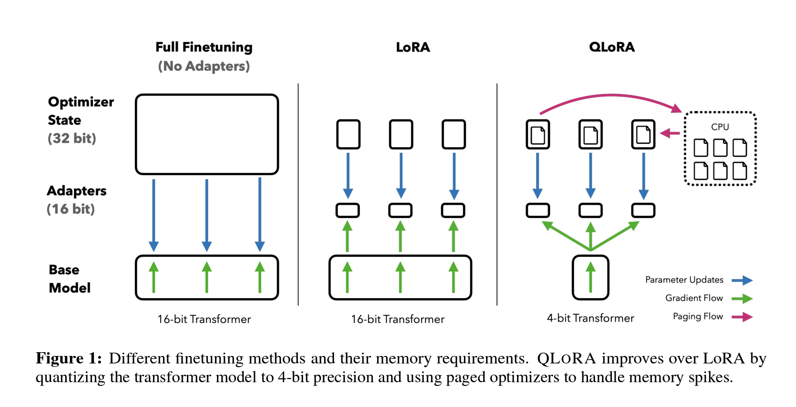

Development Status :: 2 - Pre-Alpha <br>
*Copyright (c) 2023 MinWoo Park*


##### [Korean Guanaco Jindo](https://github.com/dsdanielpark/ko-guanaco-jindo) is a preprocessing LLM (Language Model) designed to refine various LLM datasets

# Korean Guanaco Jindo [](https://github.com/dsdanielpark/ko-alpaca-jindo) [](https://github.com/dsdanielpark/ko-alpaca-jindo/blob/main/documents/README_KO.md)


[Korean Guanaco Jindo](https://github.com/dsdanielpark/ko-guanaco-jindo) is a preprocessing LLM (Language Model) designed to refine various LLM datasets such as alpaca, falcon, guanaco, and wizard. Korean Guanaco Jindo is trained based on the [Korean-Open-LLM-Datasets (KOLD) Chain](https://github.com/dsdanielpark/korean-open-llm-datasets-chain), which is a pipeline configured to utilize high-quality Korean datasets. It employs the same training method as Guanaco. <br>
[GORANI](https://github.com/dsdanielpark/GORANI) is a fine-tuned LLaMA2 model using the preprocessed data from [Korean Guanaco Jindo](https://github.com/dsdanielpark/ko-guanaco-jindo) and various architectures based on [LLaMA2](https://ai.meta.com/llama/) from [Meta AI](https://ai.meta.com/). <br>
The `jindo` in `ko-guanaco-jindo` refers to the Korean dog breed, Jindo. The term `jindo` signifies a language model specialized in preprocessing Korean language datasets, similar to `lingo`, and aims to be a lightweight and fast model tailored for processing Korean datasets for LLM(Large Language Model, "LLM") training. 
Through this experiment, we aim to translate and fine-tune the LLM models for the purpose of generating Korean LLMs. Additionally, we will explore the possibility of fine-tuning with limited GPU resources.

## Datasets
Data Pipeline: Please check the [data processing](https://github.com/dsdanielpark/ko-alpaca-jindo/blob/main/documents/DATA_PROCESSING.md) method and the approach for [revisions](https://github.com/dsdanielpark/ko-alpaca-jindo/blob/main/documents/DATA_REVISION.md). Please check the following repository for high-quality large-scale datasets in alpaca format for LLaMA finetuning: [Korean Open LLM Datasets(KOLD) Chain](https://github.com/dsdanielpark/korean-open-llm-datasets-chain).


## Foundation Model
1. [LLaMA](https://ai.meta.com/blog/large-language-model-llama-meta-ai/) from [Meta AI](https://ai.meta.com/)
If you want to download the official model, fill this [official request form](https://docs.google.com/forms/d/e/1FAIpQLSfqNECQnMkycAp2jP4Z9TFX0cGR4uf7b_fBxjY_OjhJILlKGA/viewform) and wait.
Delta weights over the original Llama model is released under [CC BY-NC-SA-4.0](https://creativecommons.org/licenses/by-nc-sa/4.0/). <br>
2. [LLaMA2](https://ai.meta.com/llama/) from [Meta AI](https://ai.meta.com/)

## Reference Model
### [Guanaco](https://huggingface.co/JosephusCheung/Guanaco)
Guanaco is an LLM based on the QLoRA 4-bit fine-tuning method developed by Tim Dettmers et. al. in the UW NLP group. It achieves 99% ChatGPT performance on the Vicuna benchmark.

**Features**
- Uses LoRA fine-tuning method
- Fine-tunes up to a 65B parameter model on a 48GB GPU without performance loss compared to 16-bit models
- Outperforms all previous models on the Vicuna benchmark
- Initial Release: 2023-05-23 <br>

**Reference**
- [GitHub - QLoRA](https://github.com/artidoro/qlora)
- [arXiv Paper](https://arxiv.org/abs/2305.14314)


<br><br><br><br><br><br><br><br><br><br><br><br><br><br><br>


# Appendix
## Alpaca
Alpaca 7B is a model derived from the [LLaMA 7B model](https://ai.facebook.com/blog/large-language-model-llama-meta-ai/) of [Meta](https://about.meta.com/), fine-tuned using 52K instruction-following demonstrations. In our initial evaluation, Alpaca demonstrates similar qualitative behavior to OpenAI's text-davinci-003 model, despite being significantly smaller and more affordable to reproduce (<$600). You can find the code release on [LLaMA GitHub repository](https://github.com/facebookresearch/llama).


## LoRA and QLoRA
Applying a method to fine-tune only a subset of LLM weights and optimize GPU utilization in the [Stanford Alpaca.](https://crfm.stanford.edu/2023/03/13/alpaca.html)
- [*LoRA*](https://github.com/microsoft/LoRA)(*Lo*w-*R*ank *A*daptation of Large Language Models) is a method for adapting large-scale pre-trained language models to specific tasks by introducing trainable rank decomposition matrices, significantly reducing the number of trainable parameters and GPU memory requirements, while maintaining or surpassing the performance of traditional fine-tuning approaches on various models.
- [*QLoRA*](https://github.com/artidoro/qlora)(*Q*uantized *Lo*w-*R*ank *A*daptation of Large Language Models) is an efficient finetuning approach that reduces memory usage while maintaining high performance, enabling the finetuning of large language models on a single GPU and achieving state-of-the-art results on various benchmarks.


*[https://arxiv.org/abs/2305.14314](https://arxiv.org/abs/2305.14314)*

<br>

## [Alpaca LoRA](https://github.com/tloen/alpaca-lora)
Includes code for replicating Stanford Alpaca's results using low-rank adaptation (LoRA). They offer an Instruct model of similar quality to `text-davinci-003` that can run on a Raspberry Pi for research purposes. The code can be easily extended to larger models like 13b, 30b, and 65b.
In addition to the training code, which can run within hours on a single RTX 4090, they provide a script for downloading and performing inference on the foundation model and LoRA, along with the LoRA weights. They utilize Hugging Face's PEFT and Tim Dettmers' bitsandbytes for efficient and cost-effective fine-tuning.
The LoRA model produces outputs comparable to the Stanford Alpaca model without hyperparameter tuning (see included outputs). Further tuning may lead to better performance, so tey encourage interested users to try it out and share their results.

### Docker Build
By building with the following command, the built Docker image can be used with the name `ko-alpaca-lingo:latest`.
```
docker build -t ko-alpaca-lingo:latest docker/
```

### Docker Compose

By running the following command, the alpaca-lora service will run as a Docker container, and it can be accessed through the configured port (e.g., 7860).
```
docker-compose -f docker/docker-compose.yml up
```


### Official Weights Alpaca Lora
The most recent `Official Alpaca LoRA` adapter available at tloen/alpaca-lora-7b was trained on March 26 with the following command:

### Fine-tuning Alpaca Lora
```
python finetune.py \
    --base_model 'decapoda-research/llama-7b-hf' \
    --data_path 'danielpark/ko_shargpt_deepl_cleaned_v1' \
    --output_dir './lora-alpaca' \
    --batch_size 128 \
    --micro_batch_size 4 \
    --num_epochs 3 \
    --learning_rate 1e-4 \
    --cutoff_len 512 \
    --val_set_size 2000 \
    --lora_r 8 \
    --lora_alpha 16 \
    --lora_dropout 0.05 \
    --lora_target_modules '[q_proj,v_proj]' \
    --train_on_inputs \
    --group_by_length
```

<details>
<summary> Windows CMD</summary>

```
python finetune.py ^
    --base_model 'decapoda-research/llama-7b-hf' ^
    --data_path 'danielpark/ko_shargpt_deepl_cleaned_v1' ^
    --output_dir './lora-alpaca' ^
    --batch_size 128 ^
    --micro_batch_size 4 ^
    --num_epochs 3 ^
    --learning_rate 1e-4 ^
    --cutoff_len 512 ^
    --val_set_size 2000 ^
    --lora_r 8 ^
    --lora_alpha 16 ^
    --lora_dropout 0.05 ^
    --lora_target_modules '[q_proj,v_proj]' ^
    --train_on_inputs ^
    --group_by_length

```

</details>


### Generate (Inference) Alpaca Lora

```
python generate.py \
    --load_8bit \
    --base_model 'decapoda-research/llama-7b-hf' \
    --lora_weights 'tloen/alpaca-lora-7b'
```
Or
```
python finetune.py \
    --base_model='decapoda-research/llama-7b-hf' \
    --num_epochs=10 \
    --cutoff_len=512 \
    --group_by_length \
    --output_dir='./lora-alpaca' \
    --lora_target_modules='[q_proj,k_proj,v_proj,o_proj]' \
    --lora_r=16 \
    --micro_batch_size=8
```
<details>
<summary> Windows CMD</summary>

```
python generate.py ^
    --load_8bit ^
    --base_model 'decapoda-research/llama-7b-hf' ^
    --lora_weights 'tloen/alpaca-lora-7b'
```
Or
```
python finetune.py ^
    --base_model='decapoda-research/llama-7b-hf' ^
    --num_epochs=10 ^
    --cutoff_len=512 ^
    --group_by_length ^
    --output_dir='./lora-alpaca' ^
    --lora_target_modules='[q_proj,k_proj,v_proj,o_proj]' ^
    --lora_r=16 ^
    --micro_batch_size=8
```

</details>


<br><br>

## Alpaca [QLoRA](https://github.com/artidoro/qlora)
QLoRA is an efficient finetuning approach that allows for finetuning a 65B parameter model on a single 48GB GPU while maintaining full 16-bit finetuning task performance. It utilizes 4-bit quantization and Low Rank Adapters (LoRA) to reduce memory usage. The best model, Guanaco, surpasses previous models on the Vicuna benchmark, achieving 99.3% of ChatGPT's performance level with just 24 hours of finetuning on a single GPU. QLoRA introduces innovations such as 4-bit NormalFloat (NF4) data type, Double Quantization, and Paged Optimizers to save memory without sacrificing performance. Over 1,000 models were finetuned using QLoRA, demonstrating state-of-the-art results across various datasets and model types. 


### Fine-tuning Alpaca QLoRA
You can specify the path to your dataset using the `--dataset` argument. If the `--dataset_format` argument is not set, it will default to the Alpaca format. Here are a few examples:
Training with an alpaca format dataset:
```
python qlora.py --dataset="./data/ko_shargpt_deepl_cleaned_v1.json"
```
Off-load was used to train with limited resources. Please refer to the following [Link](https://huggingface.co/docs/transformers/main/en/main_classes/quantization#offload-between-cpu-and-gpu) and [Git hash](https://github.com/dsdanielpark/ko-sharegpt-alpaca/commit/0c40cacadc724034ed578aaaae06d02c625be8af) for partial revisions. 


Training with a self-instruct format dataset:
```
python qlora.py --dataset="./data/ko_shargpt_deepl_cleaned_v1.json" --dataset_format="self-instruct"
```

<br>


## [Vicuna](https://huggingface.co/lmsys) using [FastChat](https://github.com/lm-sys/FastChat)
An open source chatbot impressing GPT-4 with 90% Chat-GPT quality. 

<br>

## [Falcon](https://huggingface.co/tiiuae/falcon-7b) from [Hugging Face](https://huggingface.co/)
Falcon-7B and Falcon-40B have been trained on 1.5 trillion and 1 trillion tokens respectively, in line with modern models optimising for inference. The key ingredient for the high quality of the Falcon models is their training data, predominantly based (>80%) on [Falcon RefinedWeb](https://huggingface.co/datasets/tiiuae/falcon-refinedweb) — a novel massive web dataset based on CommonCrawl. 

<br>

## [Orca](https://huggingface.co/papers/2306.02707)
Orca presents a novel approach to training large language models, combining progressive learning and teacher assistance to enhance imitation learning.

<br>

## [Long LLaMA](https://github.com/CStanKonrad/long_llama)
LongLLaMA is built upon the foundation of OpenLLaMA and fine-tuned using the Focused Transformer (FoT) method.
<br><br>

# [QnA](https://github.com/dsdanielpark/ko-alpaca-lingo/blob/main/documents/QNA.md)
I have compiled some common and encountered errors, along with their solutions. I hope this will be helpful to many researchers. Before creating an issue, please search for it first. If you find an error along with its solution, I would appreciate it if you could provide a pull request.

# [GORANI](https://github.com/dsdanielpark/GORANI)
Most open-source LLM models are derived from the open-source LLM weights of Meta, called LLaMA. The Python implementation of LLaMA and fine-tuning it for the Korean language can be found in the GORANI (고라니) project.

# License
I hold no legal responsibility; <br>
This project adheres to the licenses of the reference code and datasets used. It is the user's responsibility to check the licenses, and the user assumes all responsibilities regarding any licensing restrictions on this code. This repository is provided under the MIT license without any implied or explicit warranties.

```
The MIT License (MIT)

Copyright (c) 2023 Minwoo Park

Permission is hereby granted, free of charge, to any person obtaining a copy
of this software and associated documentation files (the "Software"), to deal
in the Software without restriction, including without limitation the rights
to use, copy, modify, merge, publish, distribute, sublicense, and/or sell
copies of the Software, and to permit persons to whom the Software is
furnished to do so, subject to the following conditions:

The above copyright notice and this permission notice shall be included in all
copies or substantial portions of the Software.

THE SOFTWARE IS PROVIDED "AS IS", WITHOUT WARRANTY OF ANY KIND, EXPRESS OR
IMPLIED, INCLUDING BUT NOT LIMITED TO THE WARRANTIES OF MERCHANTABILITY,
FITNESS FOR A PARTICULAR PURPOSE AND NONINFRINGEMENT. IN NO EVENT SHALL THE
AUTHORS OR COPYRIGHT HOLDERS BE LIABLE FOR ANY CLAIM, DAMAGES OR OTHER
LIABILITY, WHETHER IN AN ACTION OF CONTRACT, TORT OR OTHERWISE, ARISING FROM,
OUT OF OR IN CONNECTION WITH THE SOFTWARE OR THE USE OR OTHER DEALINGS IN THE
SOFTWARE.
```


## Bugs and Issues
Sincerely grateful for any reports on new features or bugs. Your valuable feedback on the code is highly appreciated.

## Contacts
- Core maintainer: [Daniel Park, South Korea](https://github.com/dsdanielpark) <br>
- E-mail: parkminwoo1991@gmail.com <br>


### How can delete cached model weight
```
pip install huggingface_hub["cli"]
```
```
huggingface-cli delete-cache
```

# Reference 
[1] https://github.com/tloen/alpaca-lora <br>
[2] https://github.com/huggingface/peft <br>
[3] https://github.com/artidoro/qlora <br>
[4] https://huggingface.co/timdettmers/qlora-alpaca-7b <br>
